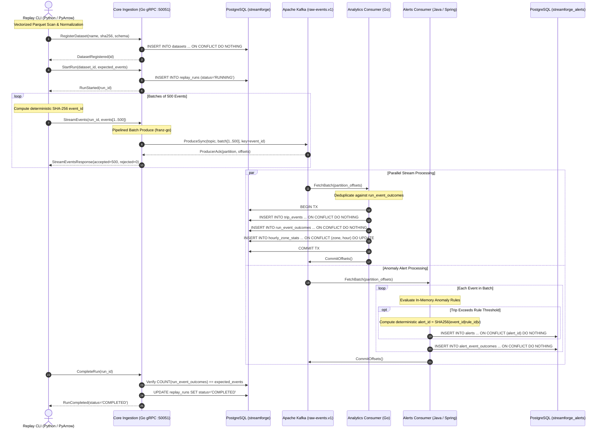
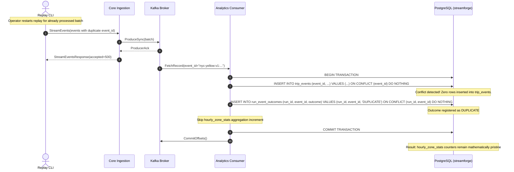
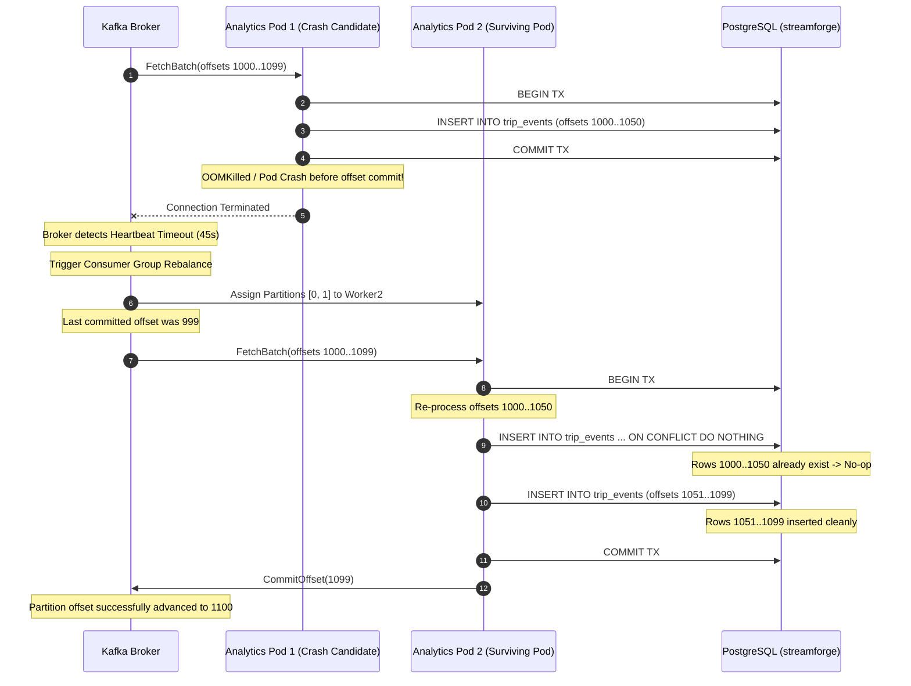
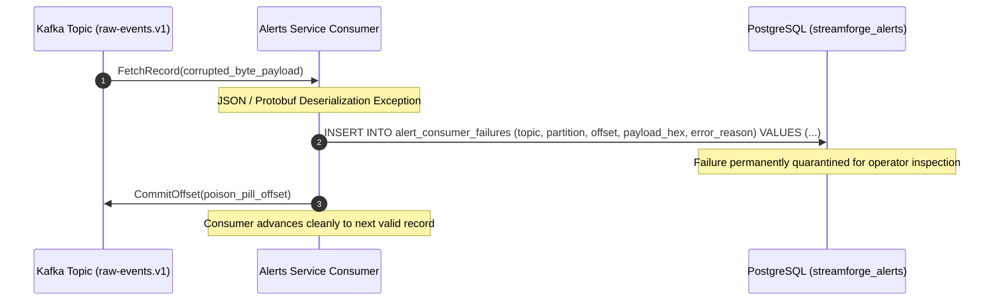

# StreamForge 2.0: Data Flow & Failure Sequence Models

## 1. End-to-End Happy Path Data Flow

The following sequence diagram details the end-to-end lifecycle of an event batch from NYC TLC Parquet file reading to durable analytics aggregation and anomaly alert generation.



---

## 2. Failure Sequence 1: Transient gRPC Producer Network Failure & Backoff

When network latency spikes or a broker election causes transient gRPC timeouts, the Replay client executes bounded exponential backoff with jitter.

```mermaid
sequenceDiagram
    autonumber
    actor CLI as Replay CLI
    participant Core as Core Ingestion (Go)
    participant Broker as Kafka Broker

    CLI->>Core: StreamEvents(batch #42, events 20501..21000)
    Core->>Broker: ProduceSync(records)
    Note over Broker: Broker Leader Election in progress...
    Broker--xCore: LeaderNotAvailable / Timeout
    Core--xCLI: gRPC UNAVAILABLE: kafka produce timeout (5000ms)

    Note over CLI: Backoff Attempt 1 (delay 500ms + jitter)
    CLI->>Core: StreamEvents(batch #42, events 20501..21000)
    Core->>Broker: ProduceSync(records)
    Broker-->>Core: ProducerAck(partition 2, offsets 8100..8599)
    Core-->>CLI: StreamEventsResponse(accepted=500)
    Note over CLI: Batch successfully committed; resumes normal replay rate
```

---

## 3. Failure Sequence 2: Replay Run Collision & Strict Idempotency

If an operator re-runs a historical dataset or replays overlapping slices, the pipeline guarantees **zero double-counting** across all financial metrics and trip counts.



---

## 4. Failure Sequence 3: Consumer Crash & Partition Rebalance

When an analytics worker pod crashes mid-batch, Kafka consumer group rebalances ensure at-least-once recovery without duplicate financial side effects.



---

## 5. Failure Sequence 4: Poison Pill / Deserialization Isolation (Dead-Letter Handling)

When an unparseable or malicious byte payload arrives on the Kafka topic, workers isolate the record into durable audit tables rather than crashlooping the consumer group.


