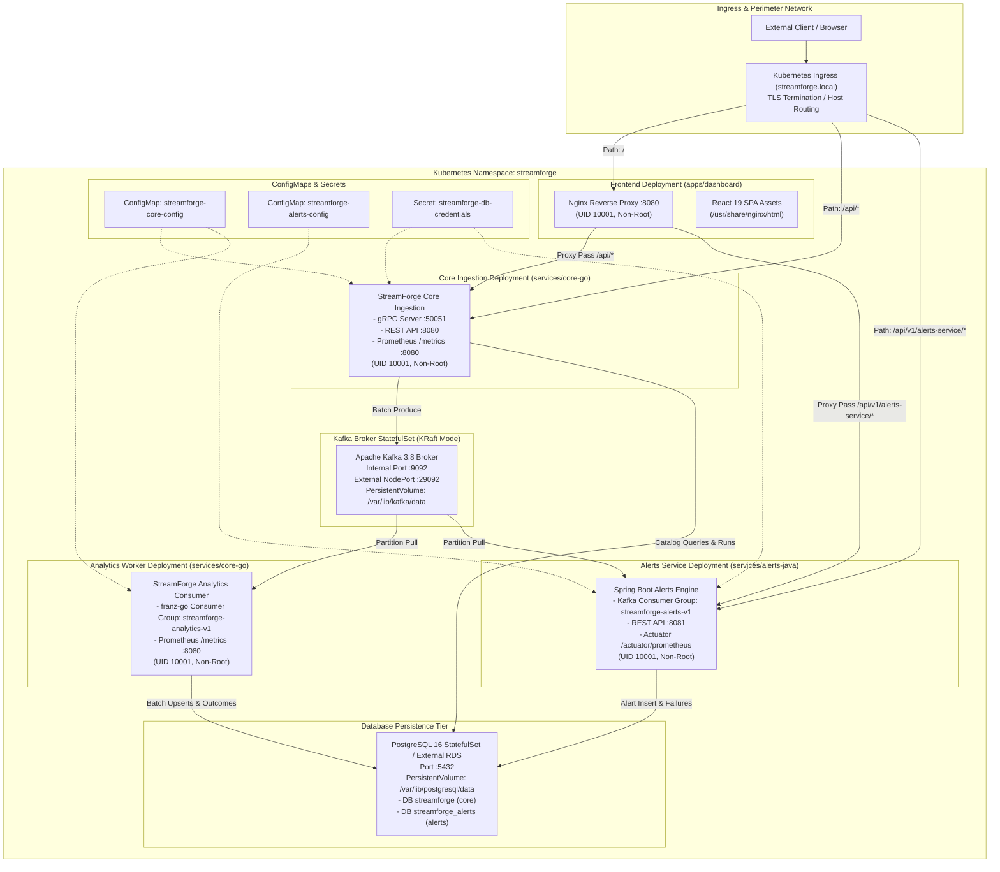

# StreamForge 2.0: Deployment Architecture

## 1. Overview & Topologies

StreamForge supports two deployment topologies designed for distinct stages of the software engineering lifecycle:

1. **Local Developer / Edge Topology (Docker Compose)**: Multi-container bridge network for rapid prototyping, isolated regression testing, and local benchmarking.
2. **Production Cloud-Native Topology (Kubernetes via Helm)**: Declarative, hardened microservices deployment managed via the `deploy/helm/streamforge` Helm chart, featuring non-root least-privilege security contexts, strict resource quotas, liveness/readiness health probes, and isolated database boundaries.

---

## 2. Kubernetes Cluster Deployment Topology



---

## 3. Network Boundaries, Protocols & Port Matrix

| Service | Pod Name / Kind | Port | Protocol | Scope | Network Security Policy |
| --- | --- | --- | --- | --- | --- |
| **Dashboard** | `streamforge-dashboard` (Deployment) | `8080` | HTTP/1.1 | Ingress / Internal | Accessible by Ingress Controller. Reverse-proxies `/api` routes internally. |
| **Core gRPC** | `streamforge-core` (Deployment) | `50051` | gRPC (HTTP/2) | ClusterIP / Ingress | Ingestion endpoint for batch replay clients. Payload capped at 4 MiB. |
| **Core REST** | `streamforge-core` (Deployment) | `8080` | HTTP/1.1 | ClusterIP | Exposes `/api/v1/datasets`, `/api/v1/runs`, `/api/v1/analytics`, `/metrics`. |
| **Analytics Consumer** | `streamforge-analytics` (Deployment) | `8080` | HTTP/1.1 | ClusterIP | Background Kafka consumer daemon. Exposes `/metrics` and `/healthz`. |
| **Alerts Service** | `streamforge-alerts` (Deployment) | `8081` | HTTP/1.1 | ClusterIP | Exposes `/api/v1/alerts`, `/api/v1/rules`, `/actuator/health`, `/actuator/prometheus`. |
| **Kafka Broker** | `streamforge-kafka` (StatefulSet) | `9092` | Kafka Wire Protocol | ClusterIP | Internal broker communications and pod partition consumption. |
| **Kafka Host** | `streamforge-kafka` (Service) | `29092` | Kafka Wire Protocol | NodePort / HostPort | Developer replay tooling and external performance benchmark harness. |
| **PostgreSQL** | `streamforge-postgres` (StatefulSet) | `5432` | PostgreSQL Native | ClusterIP | Restricted to backend service pods. Cross-database access denied by role. |

---

## 4. Container Hardening & Security Contexts

All containers in the StreamForge Kubernetes deployment conform to strict Pod Security Standards (Restricted Profile):

```yaml
securityContext:
  runAsNonRoot: true
  runAsUser: 10001
  runAsGroup: 10001
  readOnlyRootFilesystem: true
  allowPrivilegeEscalation: false
  capabilities:
    drop:
      - ALL
```

### Volume Mount Strategies for Read-Only Filesystems:
- **Nginx Dashboard**: Mounts `emptyDir` ephemeral volumes at `/var/cache/nginx`, `/var/run`, and `/tmp` to allow standard runtime PID and cache generation without compromising container immutability.
- **Go Core & Analytics**: Pure scratch execution with no local disk writes; runtime state resides in memory and commits directly to PostgreSQL.
- **Java Alerts Engine**: Mounts `emptyDir` at `/tmp` for JVM heap dump buffering, temporary logging, and Tomcat embedded work directories.

---

## 5. Resource Allocations & Quotas

Resource specifications are tuned based on empirical profiling data collected during Phase 8 benchmark runs (10,000 to 1,000,000 event scale):

| Microservice | CPU Request | CPU Limit | Memory Request | Memory Limit | Replicas | Scaling Strategy |
| --- | --- | --- | --- | --- | --- | --- |
| **`core-go`** | `250m` | `1000m` | `128Mi` | `512Mi` | 2–5 | Horizontal Pod Autoscaler (HPA) on CPU > 75% or gRPC request rate |
| **`analytics-go`** | `250m` | `1000m` | `128Mi` | `512Mi` | 2–6 | HPA triggered by Kafka consumer lag (`streamforge.raw-events.v1`) |
| **`alerts-java`** | `500m` | `2000m` | `512Mi` | `1536Mi` | 2–4 | HPA triggered by JVM CPU utilization > 80% or partition lag |
| **`dashboard`** | `50m` | `200m` | `32Mi` | `128Mi` | 2 | Static redundant replica pair behind Ingress |
| **`kafka` (KRaft)** | `500m` | `2000m` | `1024Mi` | `2048Mi` | 1–3 | Scaled via Kafka partition allocation (6 topic partitions) |
| **`postgresql`** | `500m` | `2000m` | `1024Mi` | `4096Mi` | 1 | Stateful primary with WAL archiving for PITR |

---

## 6. Liveness, Readiness & Startup Probes

To prevent cascading failures during startup or transient broker downtime, probe configurations enforce graduated readiness:

```yaml
# Core Ingestion Probe Profile
livenessProbe:
  httpGet:
    path: /healthz
    port: 8080
  initialDelaySeconds: 5
  periodSeconds: 10
  failureThreshold: 3
readinessProbe:
  httpGet:
    path: /healthz
    port: 8080
  initialDelaySeconds: 3
  periodSeconds: 5
  failureThreshold: 2

# Java Alerts Engine Probe Profile
startupProbe:
  httpGet:
    path: /actuator/health/liveness
    port: 8081
  initialDelaySeconds: 15
  periodSeconds: 5
  failureThreshold: 12
livenessProbe:
  httpGet:
    path: /actuator/health/liveness
    port: 8081
  periodSeconds: 10
readinessProbe:
  httpGet:
    path: /actuator/health/readiness
    port: 8081
  periodSeconds: 5
```

---

## 7. Configuration & Secret Management

1. **Decoupled Environment Injection**:
   - `streamforge-core-config` ConfigMap distributes broker addresses, partition counts, log formats (`json`), and batch produce limits (`500`).
   - `streamforge-alerts-config` ConfigMap distributes Kafka bootstrap servers, rule scan intervals, and alert severity thresholds.
2. **Segregated Credentials**:
   - `streamforge-db-credentials` injects database credentials as Kubernetes Secret environment variables.
   - Separate credentials are provided for `streamforge_user` (owns `streamforge` database) and `streamforge_alerts_user` (owns `streamforge_alerts` database). Under no circumstances are administrative or superuser credentials stored or accessible by application pods.
