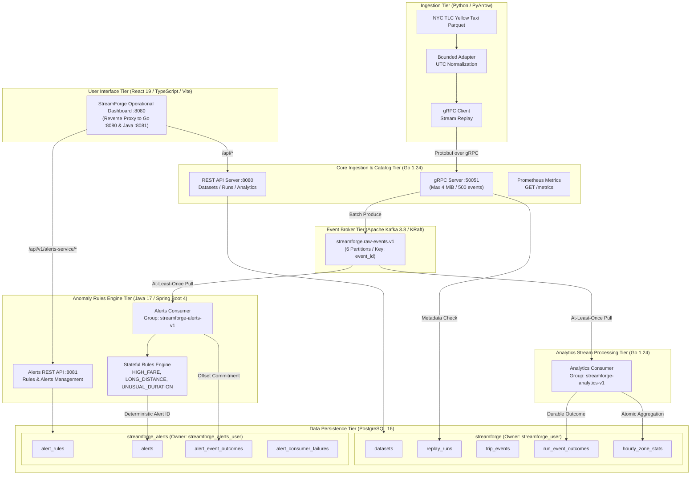

# StreamForge 2.0: Logical Architecture

## 1. System Overview

StreamForge is a distributed, polyglot data pipeline built to process and analyze large-scale historical mobility datasets with deterministic identity, strict idempotency, and sub-second anomaly alerting.



## 2. Component Boundaries & Responsibilities

| Component | Language / Runtime | Protocol | Primary Responsibility | Ownership Boundary |
| --- | --- | --- | --- | --- |
| **Replay CLI** | Python 3.11 / PyArrow | CLI / gRPC | Reads NYC TLC Parquet in bounded batches, computes SHA-256 identities, strips wall-clock ambiguities. | Source file reading and client-side retry logic. |
| **Core Service** | Go 1.24 / pgx | gRPC (:50051), HTTP (:8080) | Validates Protobuf envelopes, publishes batches to Kafka, exposes dataset/run management and aggregate query APIs. | Ingestion gatekeeper, `streamforge` database. |
| **Analytics Consumer** | Go 1.24 / franz-go | Kafka Consumer | Consumes `streamforge.raw-events.v1`, performs idempotent deduplication, updates pre-aggregated `hourly_zone_stats`. | Event aggregation, `run_event_outcomes`. |
| **Alerts Service** | Java 17 / Spring Boot 4 | Kafka Consumer, HTTP (:8081) | Consumes `streamforge.raw-events.v1`, evaluates versioned anomaly rules, persists alerts with deterministic IDs. | `streamforge_alerts` database. |
| **Dashboard** | React 19 / TypeScript | HTTP / Nginx (:8080) | Visualizes zone-hourly metrics, Kafka lag, run progress, source rejections, and live anomaly alerts. | User presentation and routing proxy. |

## 3. Protocol & Identity Contracts

1. **Deterministic Event Identity**:
   ```text
   event_id = SHA-256("nyc-yellow:v1:" + source_sha256 + ":" + row_number)
   ```
2. **Deterministic Alert Identity**:
   ```text
   alert_id = SHA-256(event_id + "|" + rule_id + "|" + rule_version)
   ```
3. **Kafka Envelope**:
   Frozen schema `streamforge.raw-event:v1` containing schema version, kind (`TRIP` or `SOURCE_REJECTION`), trip payload, and rejection context.
