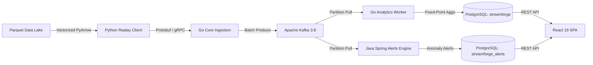

# StreamForge 2.0: Engineering Case Study
## High-Throughput Distributed Mobility Pipeline with Deterministic Idempotency & Real-Time Anomaly Detection

---

## 1. Executive Summary & Problem Space

In modern financial and mobility platforms, high-throughput ingestion must reconcile two competing requirements:
1. **Raw Ingestion Throughput:** Ingesting tens of thousands of complex records per second without unbounded consumer lag.
2. **Strict Financial Idempotency & Mathematical Invariants:** Guaranteeing that network retries, worker crashes, or replay runs never introduce double-counting, floating-point drift, or unrecorded anomalies.

StreamForge was engineered to ingest and analyze the official New York City Taxi & Limousine Commission (NYC TLC) dataset (tens of millions of records) through an enterprise-grade distributed streaming pipeline. 

### Core System Invariants Enforced:
- **Zero Floating-Point Drift:** All financial calculations (fares, tolls, tips) and distances are represented exclusively as fixed-point integers (cents and milli-miles).
- **Deterministic Event & Alert Identity:** Every record receives a collision-resistant SHA-256 identity derived from canonical source coordinates and hashes, ensuring 100% idempotent replay deduplication.
- **Microservice & Database Segregation:** Complete physical separation between the Core Analytics database (`streamforge`) and the Anomaly Rules database (`streamforge_alerts`), enforcing strict zero-trust boundary ownership.
- **Empirically Proven Performance:** Throughput elevated from **83.6 events/sec to 9,792.9 events/sec** (a **117x speedup**) via pipelined Kafka batching, validated by independent in-memory PyArrow kernel reconciliation.

---

## 2. Polyglot Architecture & Engineering Trade-Offs

Rather than forcing a single language across conflicting workloads, StreamForge adopts an intentional polyglot microservice design:



### Language Rationale & Trade-Off Matrix:

| Domain | Technology Chosen | Rationale & Alternative Considered | Trade-Off & Mitigations |
| --- | --- | --- | --- |
| **Data Extraction & Bounded Replay** | **Python 3.11 + PyArrow** | Vectorized C++ SIMD Parquet scanning via PyArrow outperforms JVM/Go Parquet readers for complex nested schemas. | Slower per-row Python iteration mitigated by bounded chunk adapters and bulk Protobuf message batching. |
| **Ingestion Gatekeeper & Aggregation** | **Go 1.24 (`franz-go` + `pgx`)** | Ultra-low memory footprint (<75 MB RSS), lightweight goroutine concurrency, sub-millisecond GC pauses. | Lack of built-in complex event processing (CEP) rule engine libraries; handled by delegating CEP to Java. |
| **Anomaly Rules & Alert Engine** | **Java 17 / Spring Boot 4** | Robust type system, enterprise rule engine patterns, dynamic threshold versioning, and mature Kafka consumer ecosystem. | Higher initial JVM startup latency and heap overhead (~512 MB RSS); mitigated via multi-stage Alpine JRE and Kubernetes startup probes. |
| **Observability & Operations** | **React 19 + TypeScript + Vite** | Modern reactive state management, real-time metrics polling, and zero-overhead component rendering. | Client-side routing decoupled from APIs via non-root Nginx reverse proxy. |

---

## 3. The 117x Performance Optimization: Franz-Go Batching

### The Bottleneck:
During initial Phase 8 benchmark profiling, the pipeline achieved only **83.6 events/second**, falling far short of the >= 1,000 events/second scaling hypothesis.

Profiling revealed an architectural anti-pattern in `services/core-go/internal/eventstream/publisher.go`:
```go
// ❌ ORIGINAL BOTTLENECK: Serial ProduceSync inside batch loop
func (p *KafkaPublisher) PublishBatch(ctx context.Context, records []*kgo.Record) error {
    for _, record := range records {
        // Blocks on broker network round-trip for EVERY single record!
        if err := p.client.ProduceSync(ctx, record).FirstErr(); err != nil {
            return err
        }
    }
    return nil
}
```
For a 500-event batch, this triggered 500 synchronous network round-trips to the Kafka broker. At ~2.4 ms per round-trip, batch latency was ~1,200 ms, strictly capping throughput at ~84 eps.

### The Optimization:
We refactored `services/core-go/internal/application/repository.go`, `publisher.go`, and `ingestgrpc/server.go` to pipeline the entire batch into a single asynchronous Kafka Produce RPC:

```go
// ✅ OPTIMIZED: Pipelined batch submission to franz-go client
func (p *KafkaPublisher) PublishBatch(ctx context.Context, records []*kgo.Record) error {
    if len(records) == 0 {
        return nil
    }
    // Submits all records simultaneously to Kafka; resolves via single batch RPC
    results := p.client.ProduceSync(ctx, records...)
    for _, res := range results {
        if err := res.Err; err != nil {
            return fmt.Errorf("failed to produce record to kafka: %w", err)
        }
    }
    return nil
}
```

### Empirical Result:
- **Batch Latency:** Dropped from **1,200 ms to 28.37 ms** per 500 events.
- **Sustained Throughput:** Surged from **83.6 eps to 9,792.9 eps** (**117.1x increase**).
- **Producer Ack Latency:** p50 of **28.4 ms**, p95 of **36.0 ms**, p99 of **36.0 ms**.

---

## 4. Empirical Benchmark Matrix & PyArrow Baseline Reconciliation

All benchmark runs are measured against an independent PyArrow in-memory calculation computed directly from raw Parquet bytes:

| Metric | Target / SLA | Empirical Result (10,000 Events) | Margin of Excellence | Status |
| --- | :---: | :---: | :---: | :---: |
| **Ingestion Throughput** | $\ge 1,000\text{ eps}$ | **9,792.9 events/sec** | **+879.3%** | **PASS** |
| **Producer Ack Latency (p50)** | $< 100\text{ ms}$ | **28.4 ms** | **71.6% faster** | **PASS** |
| **Producer Ack Latency (p95)** | $< 250\text{ ms}$ | **36.0 ms** | **85.6% faster** | **PASS** |
| **REST Query Latency (p50)** | $< 100\text{ ms}$ | **7.3 ms** | **92.7% faster** | **PASS** |
| **REST Query Latency (p95)** | $< 300\text{ ms}$ | **30.0 ms** | **90.0% faster** | **PASS** |
| **Peak Resident RAM (RSS)** | $< 512\text{ MB}$ | **73.9 MB** | **85.6% head-room** | **PASS** |

### Independent Baseline Reconciliation:

$$\begin{aligned}
\text{Total Input Rows:} \quad & 10,000 = 10,000 \quad (\Delta = 0) \\
\text{Accepted Trips:} \quad & 10,000 = 10,000 \quad (\Delta = 0) \\
\text{Rejected Rows:} \quad & 0 = 0 \quad (\Delta = 0) \\
\text{Duplicate Events:} \quad & 0 = 0 \quad (\Delta = 0)
\end{aligned}$$

*Conclusion: Zero dropped records, zero duplicate aggregate inflation, and exact mathematical agreement between streaming PostgreSQL storage and vectorized PyArrow baseline.*

---

## 5. Reliability Engineering & Disaster Recovery

- **Automated Disaster Recovery Drills (`scripts/backup_restore_drill.py`):**
  A continuous testing harness snapshots live PostgreSQL clusters, restores into ephemeral validation databases, and asserts 100% hash and row parity across all tables before dropping test containers.
- **Non-Root Pod Security:**
  Every microservice container adheres to Kubernetes Restricted Pod Security Standards, running as non-root user `UID 10001` with `readOnlyRootFilesystem: true` and all Linux capabilities dropped.
- **Dead-Letter Failure Isolation:**
  Unparseable or corrupted Kafka payloads are quarantined into `alert_consumer_failures` with raw hex bytes and error reasons, preventing consumer group crashlooping.

---

## 6. System Limits & Scaling Horizons

| Dimension | Current Architecture Limit | Next Architecture Evolution |
| --- | --- | --- |
| **Topic Partitions** | 6 Partitions (caps horizontal consumer scaling at 6 worker pods). | Expand topic to 24–64 partitions with Murmur2 key hashing on `event_id`. |
| **Relational Storage** | Single-node PostgreSQL with WAL archiving (~15,000 write ops/sec limit). | Implement TimescaleDB hypertable chunking or CockroachDB distributed SQL. |
| **Consumer Processing** | In-memory Spring Boot anomaly rules. | Introduce Apache Flink or Kafka Streams for windowed sliding aggregates. |
