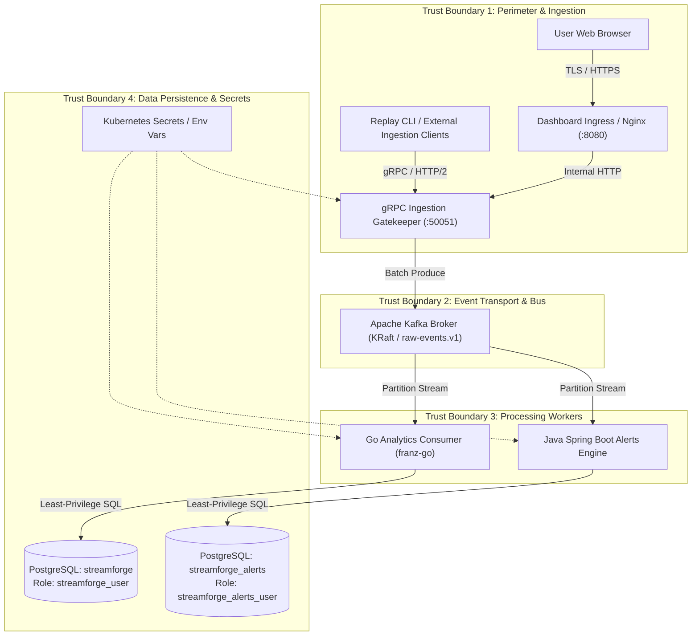

# StreamForge 2.0: Threat Model & Security Posture (STRIDE)

## 1. System Overview & Trust Boundaries

StreamForge processes high-throughput mobility event streams and provides real-time anomaly detection. To ensure resilient operations, zero data tampering, and defensive microservice isolation, security controls are mapped across four distinct trust boundaries:



---

## 2. STRIDE Threat Analysis & Defensive Mitigations

| STRIDE Category | Threat Description | Attack Vector / Impact | Implemented Mitigation & Verification |
| --- | --- | --- | --- |
| **Spoofing** | Producer Identity Spoofing | Unauthorized client injects rogue events or creates arbitrary runs. | **Deterministic Identity & Run Association:** All events must correlate to an active registered dataset (`SHA-256` verified) and a valid `run_id`. gRPC stream rejects unassociated batches with `FAILED_PRECONDITION`. Production Helm charts enforce mTLS at Ingress. |
| **Tampering** | Event Payload Modification | Attacker modifies fare amounts or trip distances in transit. | **Deterministic Hash Identity:** `event_id` is derived via SHA-256 hash over canonical source fields: `SHA256("nyc-yellow:v1:" + source_sha256 + ":" + row_number)`. Any modification causes idempotency rejection or mismatch during PyArrow baseline reconciliation. |
| **Repudiation** | Replay Run or Ingestion Denial | Tenant or operator claims events were lost or modified during pipeline processing. | **Durable Run Event Audit Log:** Every event processed is durably recorded in `run_event_outcomes` with exact timestamp, outcome (`ACCEPTED`, `REJECTED`, or `DUPLICATE`), and reason. Replay runs are sealed with final input/output counts. |
| **Information Disclosure** | Data Leakage Across Domains | Unauthorized inspection of alert rules or cross-tenant aggregate leak. | **Physical Database Segregation:** Complete physical separation between `streamforge` (core) and `streamforge_alerts`. `streamforge_user` has zero access to alerts; `streamforge_alerts_user` has zero access to trips or hourly stats. No cross-db queries permitted. |
| **Denial of Service** | Resource Exhaustion (Memory/CPU) | Oversized gRPC payloads (message bombs), unbounded batches, or memory exhaustion. | **Strict Ingestion Limits:** Protobuf message frame capped at 4 MiB. Maximum batch size hard-coded at 500 events (`MAX_BATCH_SIZE`). Rate-limited backpressure on Kafka consumer lag. Kubernetes pod memory limits enforce cgroup constraints. |
| **Elevation of Privilege** | Container Escape or DB Privilege Abuse | Attacker breaches a container and gains root OS access or database superuser access. | **Restricted Pod Security Standard:** Containers run with `runAsNonRoot: true`, `runAsUser: 10001`, `readOnlyRootFilesystem: true`, and all Linux capabilities dropped (`drop: [ALL]`). DB users are non-superusers with minimal table grants. |

---

## 3. Role-Based Access Control (RBAC) Matrix

StreamForge enforces strict role boundaries across its administrative and query interfaces:

| Operation / Capability | Anonymous / Public | Analyst Role | Operator Role | Platform Admin |
| --- | :---: | :---: | :---: | :---: |
| View System Dashboard & Aggregates | :x: | :white_check_mark: | :white_check_mark: | :white_check_mark: |
| Query Hourly Zone Statistics (`/api/v1/analytics/*`) | :x: | :white_check_mark: | :white_check_mark: | :white_check_mark: |
| Query Alerts & Audit History (`/api/v1/alerts/*`) | :x: | :white_check_mark: | :white_check_mark: | :white_check_mark: |
| Register Dataset & Start Replay Run (`/api/v1/runs`) | :x: | :x: | :white_check_mark: | :white_check_mark: |
| Create / Update Anomaly Detection Rules | :x: | :x: | :white_check_mark: | :white_check_mark: |
| Trigger Database Disaster Recovery Drill | :x: | :x: | :x: | :white_check_mark: |
| Modify Helm Values / Rotate Database Secrets | :x: | :x: | :x: | :white_check_mark: |

---

## 4. Container & Pod Security Hardening Audit

All microservices deployed via `deploy/helm/streamforge` and Dockerfiles adhere to the following automated hardening checklist (verified via `scripts/validate_helm_manifests.py`):

1. **Non-Root Execution**:
   - `services/core-go/Dockerfile`: `USER 10001:10001`
   - `services/alerts-java/Dockerfile`: `USER 10001:10001`
   - `apps/dashboard/Dockerfile`: `USER 10001:10001`
   - `tools/replay-python/Dockerfile`: `USER 10001:10001`
2. **Filesystem Immutability**:
   - Containers boot with `readOnlyRootFilesystem: true`. Temporary caches, sockets, and JVM runtimes are isolated to ephemeral non-executable `emptyDir` mounts.
3. **Capability Stripping**:
   - Linux capabilities are dropped entirely:
     ```yaml
     capabilities:
       drop:
         - ALL
     ```
   - `allowPrivilegeEscalation: false` prevents SUID binaries from acquiring elevated permissions.
4. **Secret Storage**:
   - Zero credentials, database passwords, or private keys are baked into images or stored in git repositories.
   - Credentials are injected exclusively at runtime via Kubernetes Secrets or environment files excluded by `.gitignore`.

---

## 5. Network Security Policies

In Kubernetes environments, default-deny egress policies isolate pods from unauthorized lateral movement:

```yaml
apiVersion: networking.k8s.io/v1
kind: NetworkPolicy
metadata:
  name: streamforge-core-netpol
  namespace: streamforge
spec:
  podSelector:
    matchLabels:
      app.kubernetes.io/component: core
  policyTypes:
    - Ingress
    - Egress
  ingress:
    - from:
        - podSelector:
            matchLabels:
              app.kubernetes.io/component: dashboard
        - podSelector:
            matchLabels:
              app.kubernetes.io/component: replay
      ports:
        - protocol: TCP
          port: 50051
        - protocol: TCP
          port: 8080
  egress:
    - to:
        - podSelector:
            matchLabels:
              app.kubernetes.io/component: kafka
      ports:
        - protocol: TCP
          port: 9092
    - to:
        - podSelector:
            matchLabels:
              app.kubernetes.io/component: postgres
      ports:
        - protocol: TCP
          port: 5432
```
